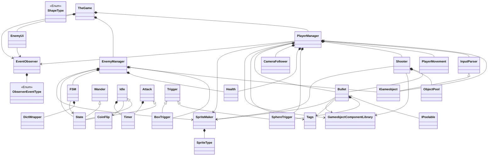
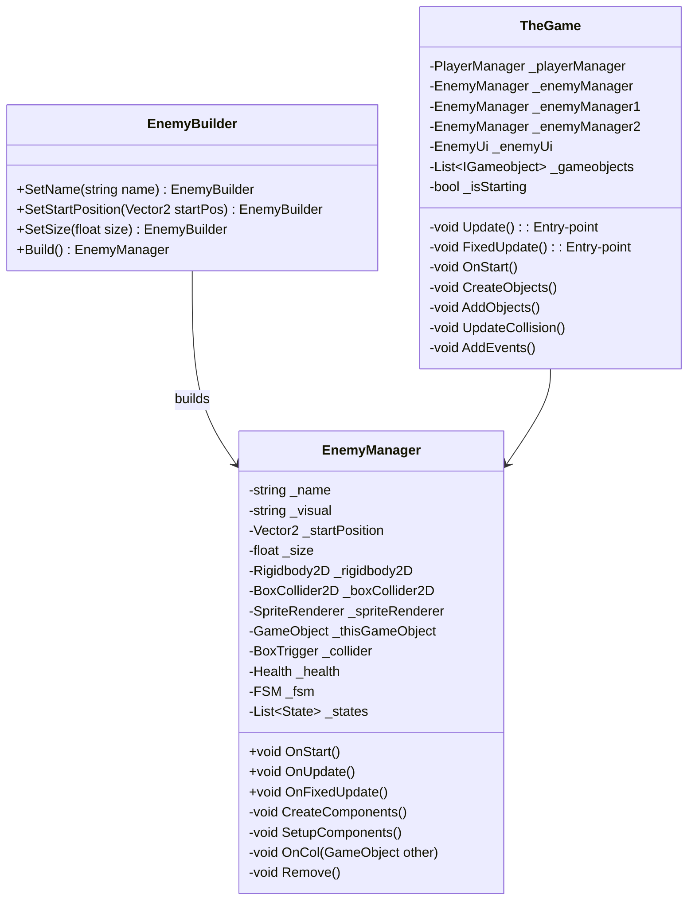
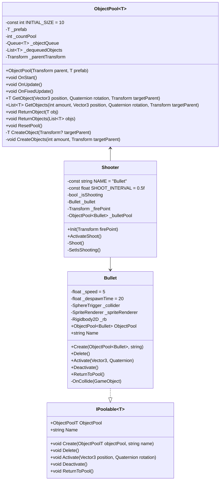
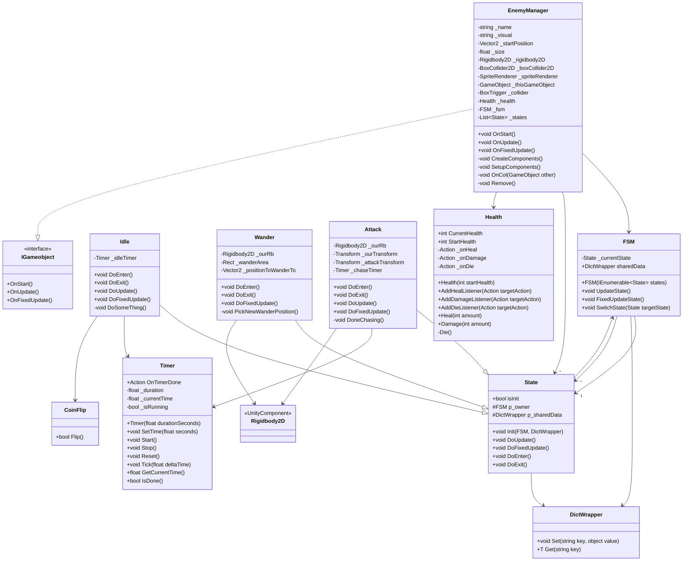

# Integrated Gameplay System
A HKU game project focused on working with design patterns. These 2 repos are practice for this project: [Domain Decomposition](https://github.com/bas-boop/DomainDecomposition) & [DesPat](https://github.com/bas-boop/DesPat).

# UML

A --> B     : solid arrow
A ..> B     : dashed arrow
A o-- B     : aggregation
A *-- B     : composition
A <|-- B    : inheritance
A <-- B     : reverse arrow

## Player

```mermaid
classDiagram

class IGameobject {
  +OnStart()
  +OnUpdate()
  +OnFixedUpdate()
}
<<interface>> IGameobject

class PlayerManager {
    -const string NAME
    -const string VISUAL
    -const string FIREPOINT
    -Rigidbody2D _rigidbody2D
    -BoxCollider2D _boxCollider2D
    -SpriteRenderer _spriteRenderer
    -InputParser _inputParser
    -PlayerMovement _playerMovement
    -Shooter _shooter
    -SphereTrigger _collider
    -Health _health
    -CameraFollower _cameraFollower
    -GameObject _thisGameObject
    -Bullet _bullet

    +OnStart()
    +OnUpdate()
    +OnFixedUpdate()

    -CreateComponents()
    -SetupComponents()
    -OnCol(GameObject other)
    -Die()
    -UpdateHealthUi()
}

class InputParser {
    -PlayerInput _playerInput
    -InputActionAsset _inputActionAsset
    -PlayerMovement _playerMovement
    -Shooter _shooter

    +OnStart()
    +OnUpdate()
    +OnFixedUpdate()
    +SetInputReferences(Dictionary~string, MonoBehaviour~ components)
    -GetReferences()
    -Init()
    -AddListeners()
    -RemoveListeners()
    -ShootAction(InputAction.CallbackContext context)
}

class PlayerMovement {
    -const float SPEED = 5f
    -const float ROTATION_SPEED = 5f
    -const float MAX_SPEED = 10f
    -Vector2 _input
    -Rigidbody2D _rigidbody2D
    -Transform _transform

    +SetInput(Vector2 input)
    +OnStart()
    +OnUpdate()
    +OnFixedUpdate()
}

class Shooter {
    -const string NAME = "Bullet"
    -const float SHOOT_INTERVAL = 0.5f
    -bool _isShooting
    -Bullet _bullet
    -Transform _firePoint
    -ObjectPool~Bullet~ _bulletPool

    +Init(Transform firePoint)
    +ActivateShoot()
    -Shoot()
    -SetIsShooting()
}

class SphereTrigger {
    +float radius = 0.5
    +IsColliding(Trigger other) (override)
    -OnDrawGizmos()
}

class Trigger {
    <<abstract>>
    +IsColliding(Trigger other)
}

class Health {
    +int CurrentHealth
    +int StartHealth
    -Action _onHeal
    -Action _onDamage
    -Action _onDie

    +Health(int startHealth)
    +AddHealListener(Action targetAction)
    +AddDamageListener(Action targetAction)
    +AddDieListener(Action targetAction)
    +Heal(int amount)
    +Damage(int amount)
    -Die()
}

class CameraFollower {
    -const float SMOOTH_SPEED = 5f
    -Transform _followTarget

    +OnStart()
    +OnUpdate()
    +OnFixedUpdate()
    +SetObjectToFollow(Transform followTarget)
}

class Bullet {
    -float _speed = 5
    -float _despawnTime = 20
    -SphereTrigger _collider
    -SpriteRenderer _spriteRenderer
    -Rigidbody2D _rb

    +ObjectPool~Bullet~ ObjectPool
    +string Name
    +Create(ObjectPool~Bullet~, string)
    +Delete()
    +Activate(Vector3, Quaternion)
    +Deactivate()
    +ReturnToPool()
    -OnCollide(GameObject)
}

class Tags{
  +const string PLAYER_TAG = "Player";
  +const string ENEMY_TAG = "Enemy";
  +const string BULLET_TAG = "Bullet";
}

class GameobjectComponentLibrary {
    -static Dictionary~string, GameObject~ _gameObjects

    +GameObject GetGameObject(string)
    +GameObject GetGameObject<T>()
    +GameObject[] GetGameObjects<T>()
    +T GetGameObjectComponent<T>()
    +T[] GetGameObjectComponents<T>()
    +bool RemoveGameobject(string)
    +T AddComponent<T>(string)
    +GameObject CreateGameObject(string)
    +void SetParent(string child, string parent)
    +GameObject AddCamera()
    +TMP_Text GetUiElement(string)
}

class SpriteMaker {
    <<static>>
    +void MakeSprite(SpriteRenderer spriteRenderer, ShapeType shapeType, Color color)
    -void DrawSquare(int, int, Texture2D, Color, Color)
    -void DrawTriangle(int, int, Texture2D, Color, Color)
    -void DrawCircle(int, int, Texture2D, Color, Color)
}

class EventObserver {
    <<static>>
    -static Dictionary~ObserverEventType, Action~ eventDict
    +void AddListener(ObserverEventType, Action)
    +void RemoveListener(ObserverEventType, Action)
    +void InvokeEvent(ObserverEventType)
}

class PlayerInput
<<UnityComponent>> PlayerInput

class InputActionAsset
<<UnityComponent>> InputActionAsset

PlayerManager <|-- IGameobject
PlayerManager *-- InputParser
PlayerManager *-- PlayerMovement
PlayerManager *-- Shooter
PlayerManager *-- SphereTrigger
PlayerManager *-- Health
PlayerManager *-- CameraFollower
PlayerManager *-- Bullet
PlayerManager --> Tags
PlayerManager --> GameobjectComponentLibrary
PlayerManager --> SpriteMaker
PlayerManager --> EventObserver

InputParser <|-- IGameobject

InputParser *-- PlayerInput
InputParser *-- InputActionAsset
InputParser *-- PlayerMovement
InputParser *-- Shooter

SphereTrigger --|> Trigger
```

## Enemy with builder

## Objectpooling

## Finite state machine - enemy

